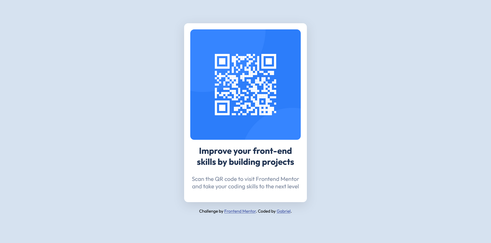

# Frontend Mentor - QR code component solution

This is a solution to the [QR code component challenge on Frontend Mentor](https://www.frontendmentor.io/challenges/qr-code-component-iux_sIO_H). Frontend Mentor challenges help you improve your coding skills by building realistic projects. 

### Screenshot

Screenshot, viewed from desktop.
### Links

- Solution URL: [Add solution URL here](https://github.com/espinoza0/qr-code-component-main)
- Live Site URL: [Add live site URL here](https://espinoza0.github.io/qr-code-component-main/)

### Built with

- Semantic HTML5 markup
- CSS custom properties
- Flexbox
